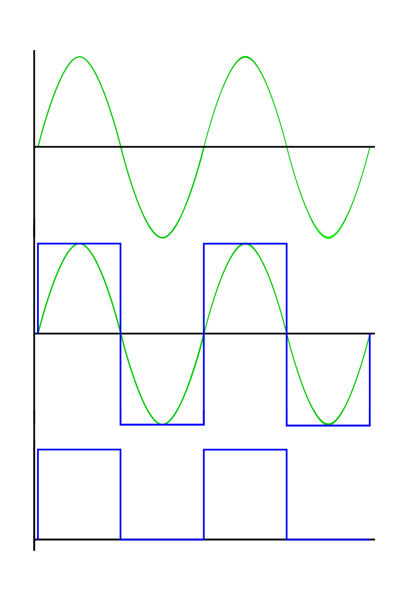
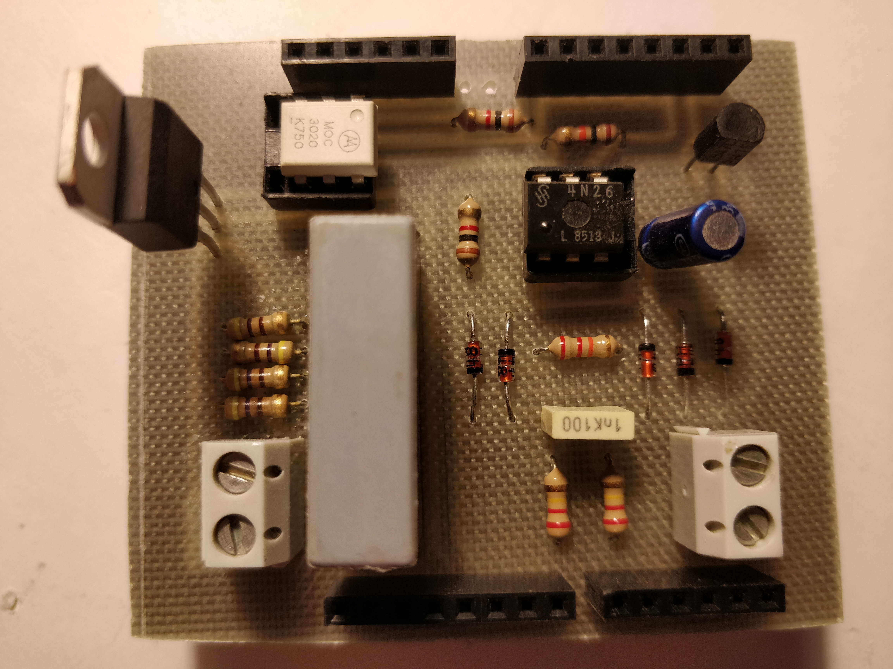
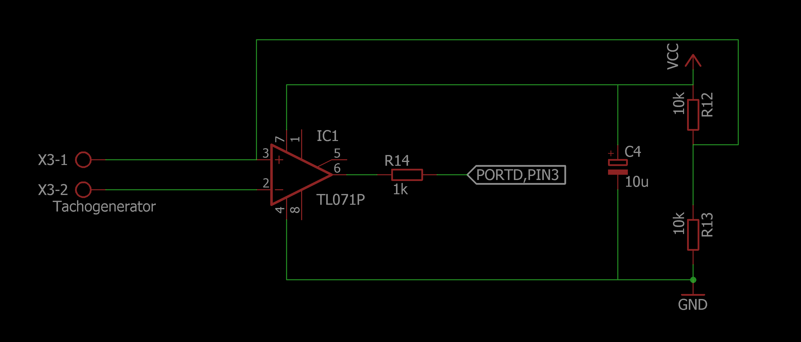
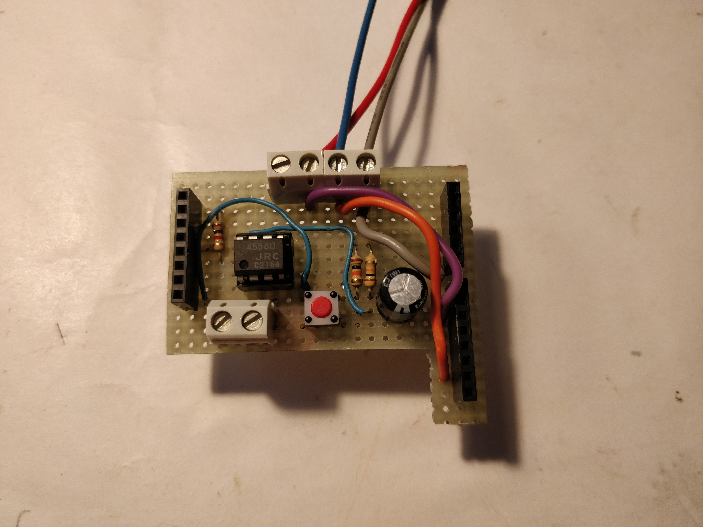
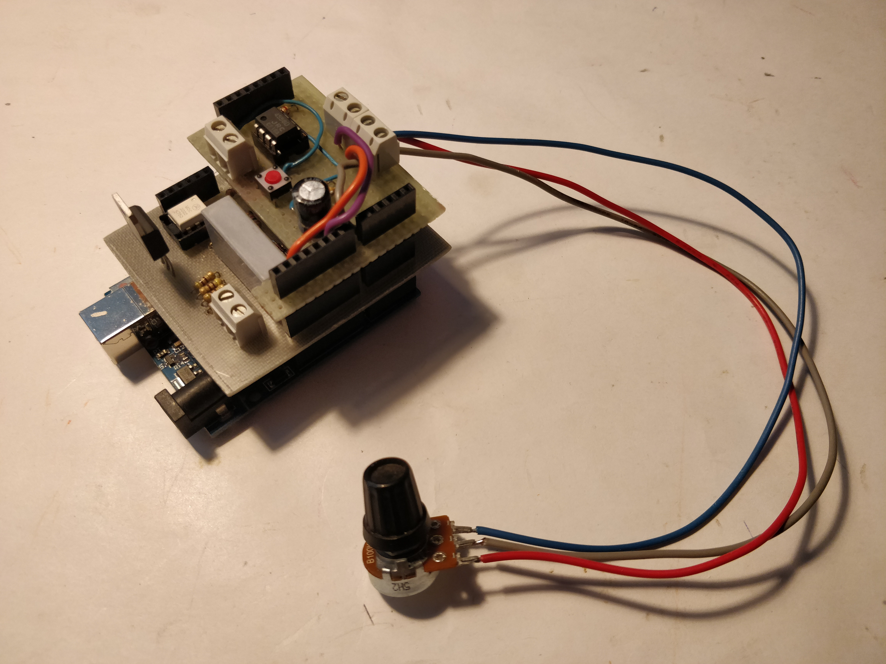
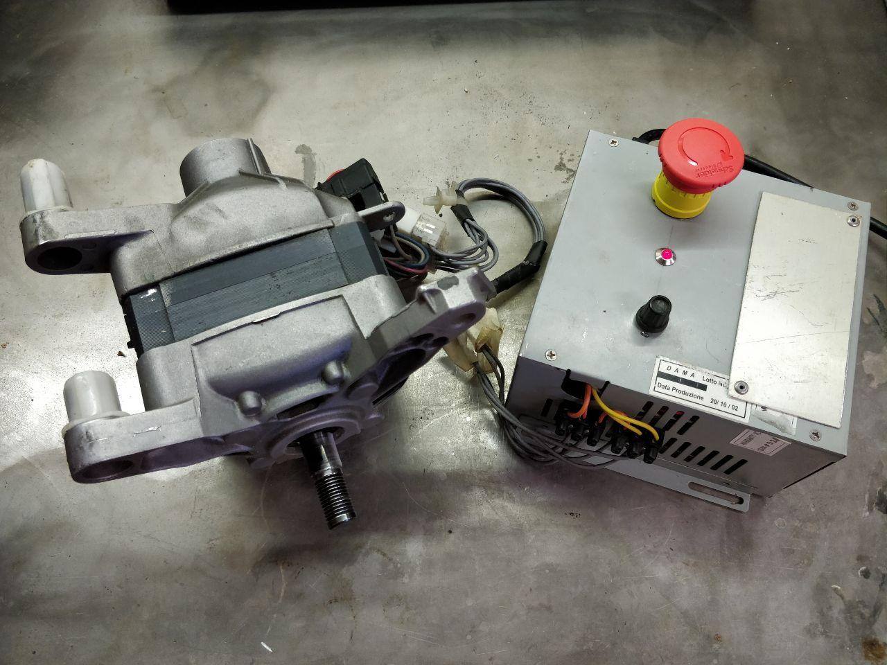

# What Universal-Motor-Controller is

Universal-Motor-Controller (UMC) is an Arduino based software and hardware intended to drive universal brushed motor, like many circuit based on TDA1085.

# Main components

UMC consist of two parts:
- software: a C/C++ code running on Atmel Atmega-328p (Arduino Uno and compatibles boards)
- hardware: divided in three parts
    - zero crossing detector circuit (zcd), used for synchronize Arduino on main power
    - power circuit, used for feed motor
    - feedback circuit, used for monitoring the speed of the motor and adjust feed power consequently

# Working principle

Image below shows UMC's working diagram


- The main power is connected to zero crossing detector circuit that transform sine wave signal to a square wave signal and send it to IC, main power source is conneted to motor power switching circuit
- IC is an Atmega-328p
- the power switching circuit is for made up of a triac, it controls the power of the motor and it is drived by IC
- the tacho is the feedback circuit of the system, it generate a signal to IC in relation to motor speed.

The main target of the driver is to changes power feeding the motor to prevent slowdowns when the load changes, to achieve this goal IC analyzes signal coming from tachogenerator and consequntly it swiches triac.

For a correct switching, IC has to know the exact phase of main power source, this is guarantee by ZCD circuit.

ZCD generates a square wave with a doubled frequency compared to main power source frequency, in my case, considering a 50Hz main frequency it generate a square wave of 100Hz.
This signal is connected to a special pin of the Atmega that is able to recognize the rising edge of ZCD output signal and rise a hardware interrupt that freeze the current program execution flow and execute a special routine. This mechanism allow to the Atmega to know when the main power source has reached the value of 0 volt so that it can syncronyze the motor power circuit.

(For a more comprensive and detailed guide about triac working principle read https://en.wikipedia.org/wiki/Thyristor and https://en.wikipedia.org/wiki/TRIAC)

The above simple mechanism is enough to drive motors and it allows to change their speed with a potentiometer, for example we could read an analog value and map it along the time interval punctuated by two rising edge coming from ZCD circuit, and switch triac in relation to that value. The figure below illustrate that mechanism


Suppose to have a potentiometer to adjust the motor power: if potentiometer is turned to left the motor power decrease otherwise it increase. To achive that we have to change the switching point of triac inside main power source half period. In our case the potentiometer is connected to one of the avr analog input pin and readed value from potentiometer is mapped into a value between 0 and 999, and assume that we divide the semiperiord in 999 slice with the same width going from 0 to 999.

Now, if the potentiometer read value is 0 we want the mimimun motor power so we have to leave triac turned off.
If potentiometer get a value of 999 the desire power is maximum, we have to excite trigger immidiatly after the 0 volt point, or equivalentemente at 0th slice.
For any other value of potentiometer we have to trigger triac at slice numbered as (999 - pot_value) where pot_value is the value readed from potentiometer.

At this point the main question is: how divide half period into equal slices to know when turn on triac?
The response is: with timers.

Basically timers are hardware device enclosed into many ICs (avrs too) that can be used to count time. Think about timer like an unsigned variable going from 0 to a max value, and its content is increased by one (or decreased by one, or set to zero) every time that something happen, the something that happens is the clock signal, eventually scaled by a constant. Hardware can be configured to execute some special code (exactly like interrupt mechanism previously described) each time timer value reaches a special value, for example its maximum value.

The Atmega-328p (like arduino) is usually clocked with a 16MHz crystal oscillator, suppose to scale the clock with a 128 factor and use that signal to feed a 8bit timer. With that configuration timer increase its value by one every 
1 / (16e6 / 128) = 0.000008 seconds or 8 microseconds, and suppose to configure hardware to execute the special code (called Interrupt Service Routine or ISR) every time timer reach maximum value that in a 8bit configuration is 255, and the ISR increase the `tick_count` variable value by one starting from 0.

After 256 * 8 = 2048 microseconds `tick_count` value is incresed to 1  
After 4096 microsecond `tick_count` value is 2  
After 6144 microsecond `tick_count` value is 3  
After 8192 microsecond `tick_count` value is 4  
...  
After 999424 microseconds `tick_count` value is 488

or equivalently, when `tick_count` is 488 approximately a seconds is passed, that is how Arduino libraries implements millis, micros and delay functions.

The idea that we use is the same: increase a variable by one periodically inside the timer's overflow ISR (executed when timer reaches its maximum value) and reset it when ZCD find a zero volt point... then reapeat.

Go back to potentiometer example. Suppose to be immediatly after a 0 volt point and ZCD has reset our variable, and also use following condition to turn on triac.

``` c++
if( tick_count >= (999 - pot_value)){
    turn_on_triac();
}
```
- if potentiometer is set to maximum value (999) then (999 - pot_value) = 0, our variable is greater or equal to 0 and the triac is turned on
- if potentiometer is set to minimum value (0) then (999 - pot_value) = 999, our variable is less than 999 and the triac remains off
- likewise intermediate values

when next 0 volt poin occur, ZCD interrupt is executed, the `tick_count` variable is reset, and the process is repeated.

At this point we have a mixture of software and hardware that is commoly called *dimmer*, a device that can change power given to a load turning a potentiometer, those kind of devices are usually used to change halogen lamps brightness, the next step is feedback circuit integration.

The feedback circuit allow system to react to load changes and increase motor power to avoid slowdowns. The feedback circuit receives a signal coming from the tachogenerator of the motor, make some process on it and send it to IC.
The tachogenerator signal is commonly an AC sine wave signal that increase its frequency and voltage as the speed increases, so it is possible use frequency or voltage or event both together to analyze the speed of the motor, in UMC frequency is used.
The tacho AC signal is converted to an AC square wave signal and then only the positive component is taken, giving to IC a DC square wave signal. The figure below show the tacho processing signal



Once IC receives the feedback signal it has to get its frequency to know the actual speed motor and change its power consequently. To do that UMC use the same tecnique used for ZCD: interrupt mechanism.

Each time feedback signal goes from low to high (rising edge) IC's hardware generates an interrupt, the normal code execution is paused and associated ISR is executed.  
Previously we have talked about measuring signal frequency, in truth we do not need know the exact frequency, instead just a value related to frequency on wich make a comparison.  
At this point is relatively simple to get an evaluation of feedback signal frequency. Do you remember the use of timer for periodically check if triac has to be turned on? Ok, we use the same routine for increase a counter associated to feedback signal and we will reset that value in ISR associated to feedback rising edge event. In that manner we have a value related to frequency: the higher the frequency (motor speed) the lower is the couter.

At this point IC has all needed parameter for controlling power motor, and for do that we use a PID controller, you can read more about PID controller on [Wikipedia](https://en.wikipedia.org/wiki/PID_controller), about 
[used library](https://playground.arduino.cc/Code/PIDLibrary) and 
[detailed library explanation](http://brettbeauregard.com/blog/2011/04/improving-the-beginners-pid-introduction/).


# Hardware
DISCLAIMER: I am not a electrical engineer and all these circuits were taken on web and put together with a limited knowledge of them. If you have suggest to improve them and UMC you are welcome.

Below are reported the schematic circuits used in UMC
### Zero crossing detector circuit


note: VCC is 5 volt, all resistor are 1/4 watt,T1 and OK1 can be changed with equivalent components.  
PORTD,PIN2 is equivalent to pin 2 on Arduino-UNO board

### Motor power circuit


note: all resisor are 1/4 watt except R8 that is 1 watt (instead one 100 ohm resistor i recilced four 470 ohm resistor in parallel) , C3 must have appropriate galvanic isolation, for T2 I used a BTB16 couse BT138 gave me some problem.  

PORTD,PIN7 is equivalent to pin 7 on Arduino-UNO board



note: zcd and motor power circuits on same pcb


### Feedback circuit



note: note: all resisor are 1/4 watt, Vcc is 9 volts, IC1 can be replaced with another opamp  

PORTD,PIN3 is equivalent to pin 3 on Arduino-UNO board

  

this board contains the potentiometer connector too and a push button connected to PORTD,PIN6 that is equivalent to pin 6 on Arduino-UNO board. We will talk about the push button later.

All together



### Motor connection

Usually universal motor has six cable:
- two for the rotor
- two for the stator
- two for the tachogenerator

The cables of tachogenerator have to be connected to the tacho circuit and the order is irrilevant.  
The rotor and stator windings have to be connected in series togheter with main AC power source and power circuit, as show below.  
**NOTE: swap stator terminals to change rotation direction of the motor.**


### UMC box

This photo show UMC with its box, taken from an old ATX power supply



### Demo video

This [video](https://youtu.be/NKULTa6kquY) is a demonstration about UMC capabilities.  
This [video](https://youtu.be/l1mFbbu4X3Q) show capabilities of UMC on low speed.  
These two [video1](https://youtu.be/YVdLVX_Wkz4) and [video2](https://youtu.be/LLw0HUfIIPY) show a motor driven by UMC connected to a bench grindstone disconnected from main power.  
This [video](https://youtu.be/WyjBL2rSP_o) show UMC with current measurement.
# Speed limiter

UMC comes with a spftearec based speed limiter. Speed limiter use the feedback signal to to achive this goal. Speed limiter is usefull because it allow to map all potentiometer turning range inside the desired motor speed limits.  
In some application we could need maximum motor speed around 2000 rmp and in other 4000 rmp, but we want reach those speed when potentiometer is completely at the most, and leave hardware and software as they are, without needs of modifications.
At the moment it is possible limit the speed only during avr's boot process using the *programming button*.
Programming Button is a push button that if pressed connect PORTD,PIN6 (pin 6 of Arduino Uno) to ground, and allow us to set limit speed values (low and high), these values are stored in avr's EEPROM so they are accessible at the next restart, whitout needs to set up them every time.

**CAUTION: programming button is used to switch from automatic to manual mode too. Manual mode allow to disable the feedback circuit and use UMC as a simple dimmer. Suppose to have upper speed limit set to 1000 rpm and runnign motor with this speed, so with potentiometer at maximum. If you press programming button in this condition the motor will receice all possible power and its speed will increase with possible motor or equipment damage.**

### Usage

- Connect Arduino to PC, on Arduino IDE open serial monitor (ensure all parameter are correct: serial port, board etc)
- press and hold the *programming button*
- reset the board keeping *programming button* pressed
- read serial monitor keeping *programming button* pressed and follow printed instructions

At the end of process if you turn potentiometer the speed motor is limeted inside selected range.

# Configuration

Attention: before reading this section be sure that you know what PID parameters are, otherwise follow links at the end of "Working principle" section.

With 1.0.1 version UMC comes with dynamic PID parameter change. Basically UMC can change its PID parameter in relation to motor speed, in fact some parameters that work correctly at a fixed speed can be wrong at lower or higher speed, making UMC non-reactive or causing rotation spikes.  
To achive this gol the constructor of PID library take extra parameters, such as a function, that it is called inside `compute()` PID function to get the correct PID parameters.
That function is named `search` and it is placed inside `configuration.h` file. You have to customize `search` function to satisfy your preferences.
The signature of `search` function is the following
``` c++
CoefficientPtr search() {
    ...
}
```
it must return a `CoefficientPtr` that is define in `PID_ASYNC.h` as
``` c++
typedef struct _coefficient {
  double Kp;
  double Ki;
  double Kd;
} Coefficient;

typedef Coefficient *CoefficientPtr;
```
Inside `configuration.h` file you can find an example of search function that meets my needs, the code is the following
``` c++
//static parameter declaration
Coefficient k_param[9];

/**
* function called inside setup() to fetch parameter
*/
void init_params() {
  k_param[0].Kp = 0.3;
  k_param[0].Ki = 0.0001;
  k_param[0].Kd = 0;

  k_param[1].Kp = 0.8;
  k_param[1].Ki = 0.0001;
  k_param[1].Kd = 0;

  k_param[2].Kp = 1;
  k_param[2].Ki = 0.0001;
  k_param[2].Kd = 0;

  k_param[3].Kp = 1.5;
  k_param[3].Ki = 0.0002;
  k_param[3].Kd = 0;

  k_param[4].Kp = 2;
  k_param[4].Ki = 0.0002;
  k_param[4].Kd = 0;

  k_param[5].Kp = 3;
  k_param[5].Ki = 0.0002;
  k_param[5].Kd = 0;

  k_param[6].Kp = 3;
  k_param[6].Ki = 0.001;
  k_param[6].Kd = 0;

  k_param[7].Kp = 3;
  k_param[7].Ki = 0.001;
  k_param[7].Kd = 0;

  k_param[8].Kp = 7;
  k_param[8].Ki = 0.002;
  k_param[8].Kd = 0;
}

/**
 * function called inside compute() PID function
 * get the minimum value from Setpoint and Input 
 * and use it to chose the correct parameters
 */
CoefficientPtr search() {
  double _val = min(Setpoint, Input);
  uint8_t index = 0;

  if (_val >= 550) {
    index = 0;
  } else if (_val >= 500 && _val < 550) {
    index = 1;
  } else if (_val >= 450 && _val < 500) {
    index = 2;
  } else if (_val >= 400 && _val < 450) {
    index = 3;
  } else if (_val >= 350 && _val < 400) {
    index = 4;
  } else if (_val >= 250 && _val < 350) {
    index = 5;
  } else if (_val >= 200 && _val < 250) {
    index = 6;
  } else if (_val >= 150 && _val < 200) {
    index = 7;
  } else if (_val <= 150) {
    index = 8;
  }
  return &k_param[index];
}
```

- on the top an array is declared to hold different `Coefficient` structures,
- the method `init_params()` is declared, it allow you to initialize the array, in the above code it is initialized statically, but you could need to read some value from EEPROM and store them inside it.
- the `search` function is declared, it is responsible for providing dynamic parameters to PID in relation to the speed of the motor.

Inside `configuration.h` file you have access to all available global variables, for example Setpoint, Input and Output PID variables, but **DON'T MODIFY THEM, JUST READ THEM**.

Ok... but, where those value (500, 350 and so on) come from?  
They come from **test mode**. *test mode* allow you to run UMC, change speed with potentiometer and set dynamically PID parameters to test them with no need to flash the ROM of the avr everytime.
To use *test mode* uncomment first line in the `Universal_Motor_Controller.ino` file to get
``` c++
#define TEST_MODE
```
and then flash avr.  
Open serial monitor, current *Setpoint*, *Input* and *Output* values are shown. You can change the *kp*, *ki* and *kd* parameters in serial input, giving the command
``` bash
<param_name> <value>
```
where `param_name` can be 
``` bash
kp
ki
kd
```
to set respectively proportional, integral or derivative parameter  
and `value` is a floating point value like 
``` bash
0.0002
```
**ATTENTION: THERE IS ONLY ONE SPACE BERTWEEN TWO ARGUMENTS** 

**ATTENTION: PARAMETERS MUST BE GIVEN SEPARATELY, YOU CAN'T SET THEM ALL TOGHETER, ONLY ONE BY ONE**  

**ATTENTION: K-VALUES ARE SHOWN WITH EIGHT DECIMAL DIGIT PRECISION**

While program runs it shows current *Setpoint* and *Input* values that can be used to discriminate the correct PID weights inside *search* function, that is where previous unknow numbers come from. With these value it is possible to see how UMC react to load change, considering that *Input* value should be near as possible to *Setpoint*.

Once done you can create your own `init_params` and `search` function and comment first line into `Universal_Motor_Controller.ino` file to get
``` c++
//#define TEST_MODE
```
and flash again.

Enjoy!

# Changelog

v1.0.1
- UMC comes with its own version of PID library, it is heavily based on Brett Beauregard's PID library  
(library link:  https://playground.arduino.cc/Code/PIDLibrary  
email: <br3ttb@gmail.com>  
library explanation: http://brettbeauregard.com/blog/2011/04/improving-the-beginners-pid-introduction/): the new version is basically identical to Brett Beauregard's version except for the facts that it is now asynchronous and some unused methods are deleted.
- UMC can now change its PID parameters dynamically, related to motor speed.
- Improved motor stability on low speed
- Code revisiting.
- UMC comes now with a test mode usefull for calibration.

# Known problems and Improvements

This is an early UMC version and there are many things to improve.  
I hope that someone will find this project interesting helping me (and diyers community) to improve its capabilities.

### Higher priority 
- Improve initial frequency calculation by decreasing needed time
- Avoid gives full power if zero crossing detector circuit fail
- Motor hang detection
- Slow start integration
- Allow rotation inversion

### Lower priority

- Lower speed limit can't be set to 0.
- Program lives as it is, there isn't an Object Oriented Programming model and integrations with other libraries are difficult due to time dependent application nature.
- UMC doesn't allow connect multiple motor due low number of Atmega-328p interrupt pins. One is necessary for ZCD circuit the other for feedback circuit. I'm trying to remove this lack using a frequncy to analog converter that technically will allow drive up to six motor. Should be possible monitor feedback signal without the need of interrupt pin by checking it periodically inside timer's ISR, but I have not tested this method yet.
- OOP usage is releted to the above two problems.

